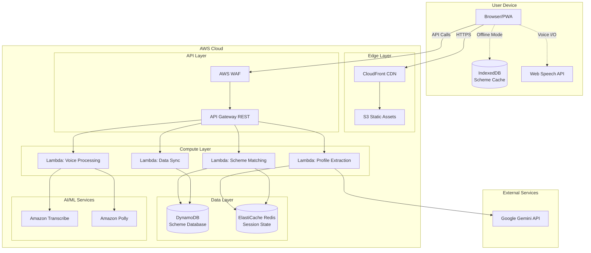
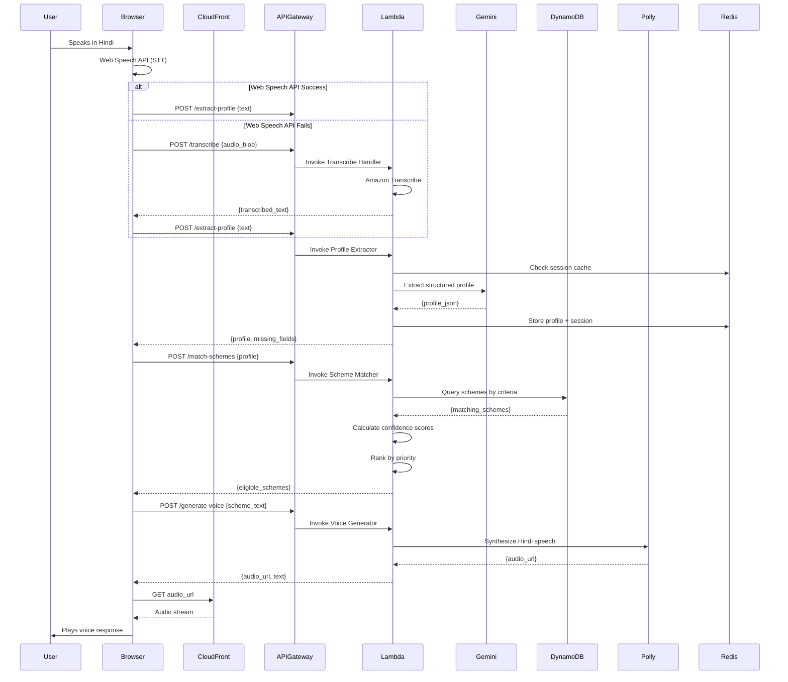
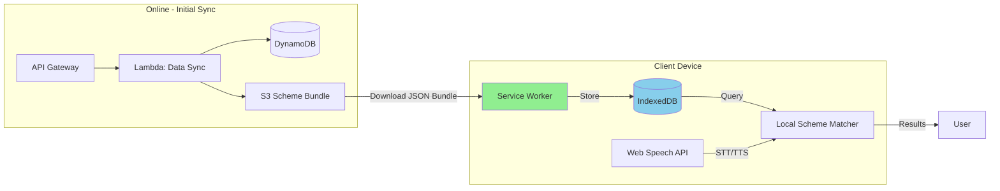

# Design Document

## Overview

Sahayak is a voice-first AI-powered government scheme navigator built on a fully serverless AWS architecture. The system enables rural Indian citizens to discover welfare schemes through natural language conversations in Hindi and English, with plans for additional regional languages.

### Core Design Principles

1. **Voice-First**: Every interaction can be completed through voice alone, removing literacy barriers
2. **Offline-Capable**: Core functionality works without internet after initial data sync
3. **Privacy-First**: No personal data retention after session ends
4. **Low-Bandwidth Optimized**: Functions on 2G connections (50-100 kbps)
5. **Serverless Architecture**: Zero-cost scaling using AWS managed services
6. **AI-Powered Intelligence**: Google Gemini for natural language understanding and reasoning

### Technology Stack Summary

- **Frontend**: Astro (SSG/SSR) + React Islands + PWA
- **Backend**: AWS Lambda + API Gateway + DynamoDB
- **AI/ML**: Google Gemini API, Amazon Transcribe, Amazon Polly
- **Storage**: Amazon S3 + CloudFront CDN + IndexedDB (client-side)
- **Caching**: ElastiCache (Redis) for session state
- **Monitoring**: CloudWatch + X-Ray
- **CI/CD**: GitHub Actions or AWS CodePipeline

## Architecture

### High-Level System Architecture




### Detailed Request Flow



### Offline Mode Architecture




## Components and Interfaces

### Frontend Components

#### 1. Voice Input Component

**Responsibility**: Capture and transcribe user speech

**Interface**:
```typescript
interface VoiceInputComponent {
  startRecording(): Promise<void>;
  stopRecording(): Promise<AudioBlob | string>;
  getTranscription(): Promise<string>;
  setLanguage(lang: 'hi' | 'en'): void;
  onTranscriptionComplete(callback: (text: string) => void): void;
  onError(callback: (error: Error) => void): void;
}
```

**Implementation Details**:
- Uses Web Speech API (`webkitSpeechRecognition` or `SpeechRecognition`) as primary method
- Falls back to recording audio blob and sending to backend if Web Speech API unavailable
- Implements noise filtering using Web Audio API
- Supports continuous recognition with interim results
- Handles browser compatibility (Chrome, Firefox, Samsung Internet)

#### 2. Voice Output Component

**Responsibility**: Generate and play audio responses

**Interface**:
```typescript
interface VoiceOutputComponent {
  speak(text: string, language: 'hi' | 'en'): Promise<void>;
  pause(): void;
  resume(): void;
  stop(): void;
  setVoice(voice: 'male' | 'female'): void;
  setSpeed(rate: number): void; // 0.5 to 2.0
  onSpeakingComplete(callback: () => void): void;
}
```

**Implementation Details**:
- Online mode: Fetches pre-generated Polly audio from CloudFront
- Offline mode: Uses Web Speech API `speechSynthesis`
- Caches frequently used audio clips in IndexedDB
- Provides playback controls (pause, resume, replay, skip)
- Displays visual waveform during playback

#### 3. Profile Manager Component

**Responsibility**: Manage user profile extraction and updates

**Interface**:
```typescript
interface ProfileManager {
  extractProfile(transcript: string): Promise<UserProfile>;
  updateProfile(updates: Partial<UserProfile>): Promise<UserProfile>;
  getMissingFields(): string[];
  getProfile(): UserProfile;
  clearProfile(): void;
}

interface UserProfile {
  name?: string;
  age?: number;
  gender?: 'male' | 'female' | 'other';
  state?: string;
  district?: string;
  ruralUrban?: 'rural' | 'urban';
  socialCategory?: 'SC' | 'ST' | 'OBC' | 'General' | 'Minority';
  annualIncome?: number;
  occupation?: string;
  landOwnership?: number; // in acres
  maritalStatus?: string;
  numberOfChildren?: number;
  educationLevel?: string;
  disabilities?: string[];
  housingType?: 'owned' | 'rented' | 'homeless';
  existingSchemes?: string[];
}
```

**Implementation Details**:
- Calls backend API for AI-powered extraction
- Maintains profile state in React context
- Validates extracted data against expected formats
- Handles incremental profile updates during conversation
- Stores profile temporarily in sessionStorage (cleared on session end)

#### 4. Scheme Matcher Component

**Responsibility**: Match user profile against scheme database

**Interface**:
```typescript
interface SchemeMatcher {
  matchSchemes(profile: UserProfile): Promise<EligibleScheme[]>;
  getSchemeDetails(schemeId: string): Promise<SchemeDetails>;
  searchSchemes(query: string): Promise<SchemeDetails[]>;
  browseByCategory(category: SchemeCategory): Promise<SchemeDetails[]>;
}

interface EligibleScheme {
  schemeId: string;
  schemeName: string;
  department: string;
  confidenceScore: 1 | 2 | 3 | 4 | 5;
  matchReason: string;
  benefits: string;
  monetaryValue?: number;
  priority: number;
}

interface SchemeDetails {
  schemeId: string;
  schemeName: string;
  department: string;
  level: 'central' | 'state';
  description: string;
  eligibilityCriteria: EligibilityCriteria;
  benefits: string;
  monetaryValue?: number;
  requiredDocuments: Document[];
  applicationProcess: ApplicationProcess;
  deadline?: string;
  officialWebsite?: string;
}

interface EligibilityCriteria {
  ageRange?: { min: number; max: number };
  incomeCeiling?: number;
  socialCategories?: string[];
  occupations?: string[];
  states?: string[];
  gender?: string[];
  otherCriteria?: Record<string, any>;
}
```

**Implementation Details**:
- Online mode: Calls backend Lambda function
- Offline mode: Queries IndexedDB with local matching logic
- Implements confidence scoring algorithm
- Ranks schemes by monetary value, ease of application, deadline urgency
- Caches match results for session duration

#### 5. Offline Data Manager

**Responsibility**: Manage offline data synchronization

**Interface**:
```typescript
interface OfflineDataManager {
  syncSchemeDatabase(): Promise<void>;
  getLastSyncTime(): Date | null;
  isDataStale(): boolean;
  getSchemeCount(): number;
  clearCache(): Promise<void>;
  getStorageUsage(): Promise<number>; // in MB
}
```

**Implementation Details**:
- Downloads compressed JSON bundle from S3/CloudFront
- Stores in IndexedDB with versioning
- Implements incremental updates (delta sync)
- Monitors storage quota and manages cleanup
- Provides sync status indicators to user


### Backend Components (AWS Lambda Functions)

#### 1. Profile Extraction Lambda

**Responsibility**: Extract structured profile from natural language using Gemini AI

**Handler**: `profileExtractor.handler`

**Input**:
```typescript
interface ProfileExtractionRequest {
  transcribedText: string;
  language: 'hi' | 'en';
  sessionId?: string;
  existingProfile?: Partial<UserProfile>;
}
```

**Output**:
```typescript
interface ProfileExtractionResponse {
  profile: UserProfile;
  missingFields: string[];
  clarificationNeeded: boolean;
  followUpQuestion?: string;
  confidence: number; // 0-1
}
```

**Implementation Details**:
- Constructs structured prompt for Gemini API with few-shot examples
- Parses Gemini response into UserProfile schema
- Validates extracted data against expected formats
- Merges with existing profile if sessionId provided
- Stores updated profile in Redis with 30-minute TTL
- Handles Hindi transliteration and colloquial terms
- Implements retry logic for API failures

**Gemini Prompt Template**:
```
You are an AI assistant helping rural Indian citizens discover government schemes.
Extract structured profile information from the user's natural language description.

User said (in Hindi): "{transcribedText}"

Extract the following fields if mentioned:
- age (number)
- gender (male/female/other)
- state (Indian state name)
- district (district name)
- social_category (SC/ST/OBC/General/Minority)
- annual_income (in rupees)
- occupation (farmer/laborer/student/unemployed/etc)
- marital_status (married/unmarried/widow/divorced)
...

Return JSON only. If a field is not mentioned, omit it.
Map colloquial terms: "yadav" -> OBC, "dalit" -> SC, "adivasi" -> ST

Output format:
{
  "profile": {...},
  "missing_critical_fields": [...],
  "confidence": 0.85
}
```

#### 2. Scheme Matching Lambda

**Responsibility**: Match user profile against scheme eligibility criteria

**Handler**: `schemeMatcher.handler`

**Input**:
```typescript
interface SchemeMatchRequest {
  profile: UserProfile;
  limit?: number; // default 20
  includePartialMatches?: boolean;
}
```

**Output**:
```typescript
interface SchemeMatchResponse {
  eligibleSchemes: EligibleScheme[];
  totalMatches: number;
  processingTimeMs: number;
}
```

**Implementation Details**:
- Queries DynamoDB with composite filters based on profile attributes
- Uses DynamoDB GSI (Global Secondary Index) for efficient querying by category, state, income
- Implements rule-based matching engine for complex eligibility criteria
- Calculates confidence scores based on criteria match percentage
- Ranks schemes using weighted scoring:
  - Monetary value: 40%
  - Confidence score: 30%
  - Deadline urgency: 20%
  - Ease of application: 10%
- Caches results in Redis for 30 minutes
- Implements pagination for large result sets

**Matching Algorithm**:
```typescript
function calculateConfidenceScore(profile: UserProfile, criteria: EligibilityCriteria): number {
  let matchedCriteria = 0;
  let totalCriteria = 0;

  // Age check
  if (criteria.ageRange) {
    totalCriteria++;
    if (profile.age >= criteria.ageRange.min && profile.age <= criteria.ageRange.max) {
      matchedCriteria++;
    }
  }

  // Income check
  if (criteria.incomeCeiling) {
    totalCriteria++;
    if (profile.annualIncome <= criteria.incomeCeiling) {
      matchedCriteria++;
    }
  }

  // Social category check
  if (criteria.socialCategories) {
    totalCriteria++;
    if (criteria.socialCategories.includes(profile.socialCategory)) {
      matchedCriteria++;
    }
  }

  // ... more criteria checks

  return matchedCriteria / totalCriteria;
}
```

#### 3. Voice Processing Lambda

**Responsibility**: Handle speech-to-text and text-to-speech operations

**Handler**: `voiceProcessor.handler`

**Endpoints**:

**POST /transcribe**
```typescript
interface TranscribeRequest {
  audioBlob: string; // base64 encoded
  language: 'hi' | 'en';
}

interface TranscribeResponse {
  transcribedText: string;
  confidence: number;
}
```

**POST /synthesize**
```typescript
interface SynthesizeRequest {
  text: string;
  language: 'hi' | 'en';
  voice?: 'male' | 'female';
}

interface SynthesizeResponse {
  audioUrl: string; // S3/CloudFront URL
  duration: number; // in seconds
}
```

**Implementation Details**:
- Transcribe: Calls Amazon Transcribe with Hindi language model
- Synthesize: Calls Amazon Polly with neural voice "Kajal" for Hindi
- Stores generated audio in S3 with 24-hour expiration
- Implements audio compression for bandwidth optimization
- Caches common phrases to reduce Polly API calls
- Handles audio format conversion (MP3, OGG)

#### 4. Data Sync Lambda

**Responsibility**: Generate and update offline scheme data bundles

**Handler**: `dataSync.handler`

**Scheduled Trigger**: Daily at 2 AM IST (CloudWatch Events)

**Implementation Details**:
- Queries all schemes from DynamoDB
- Generates compressed JSON bundle (gzip)
- Includes version number and timestamp
- Uploads to S3 bucket
- Invalidates CloudFront cache
- Generates delta updates for incremental sync
- Logs sync statistics to CloudWatch

**Bundle Structure**:
```typescript
interface OfflineBundle {
  version: string; // "2024-01-15-v1"
  generatedAt: string; // ISO timestamp
  schemeCount: number;
  schemes: SchemeDetails[];
  documents: DocumentInfo[];
  offices: OfficeInfo[];
}
```


### API Gateway Endpoints

#### REST API Endpoints

| Method | Endpoint | Description | Auth Required |
|--------|----------|-------------|---------------|
| POST | `/api/profile/extract` | Extract profile from text | No |
| POST | `/api/profile/update` | Update existing profile | No |
| GET | `/api/profile/{sessionId}` | Retrieve profile by session | No |
| POST | `/api/schemes/match` | Match schemes to profile | No |
| GET | `/api/schemes/{schemeId}` | Get scheme details | No |
| GET | `/api/schemes/search` | Search schemes by keyword | No |
| GET | `/api/schemes/category/{category}` | Browse schemes by category | No |
| POST | `/api/voice/transcribe` | Transcribe audio to text | No |
| POST | `/api/voice/synthesize` | Synthesize text to speech | No |
| GET | `/api/data/sync` | Get offline data bundle info | No |
| GET | `/api/data/bundle` | Download offline bundle | No |
| POST | `/api/report/generate` | Generate shareable report | No |

#### API Gateway Configuration

**Throttling**:
- Burst limit: 100 requests
- Rate limit: 50 requests per second per IP

**CORS Configuration**:
```json
{
  "allowOrigins": ["https://sahayak.gov.in", "http://localhost:3000"],
  "allowMethods": ["GET", "POST", "OPTIONS"],
  "allowHeaders": ["Content-Type", "X-Session-Id"],
  "maxAge": 3600
}
```

**Request Validation**:
- Enforce JSON schema validation on all POST requests
- Maximum request body size: 10MB (for audio uploads)
- Timeout: 29 seconds (API Gateway maximum)

**WAF Rules**:
- Rate-based rule: Block IPs exceeding 100 requests/5 minutes
- SQL injection protection
- XSS protection
- Geographic restriction: Allow only India + development IPs


## Data Models

### DynamoDB Schema

#### Schemes Table

**Table Name**: `sahayak-schemes`

**Primary Key**:
- Partition Key: `schemeId` (String) - Format: `{level}-{state}-{dept}-{name}` e.g., `central-all-agri-pmkisan`

**Attributes**:
```typescript
interface SchemeRecord {
  schemeId: string; // PK
  schemeName: string;
  schemeNameHindi: string;
  department: string;
  level: 'central' | 'state';
  state?: string; // for state-level schemes
  description: string;
  descriptionHindi: string;
  category: 'agriculture' | 'education' | 'healthcare' | 'housing' | 'pension' | 'skill' | 'other';
  
  // Eligibility criteria (structured for querying)
  eligibility: {
    ageMin?: number;
    ageMax?: number;
    incomeCeiling?: number;
    socialCategories?: string[]; // ['SC', 'ST', 'OBC']
    gender?: string[]; // ['female', 'male', 'other']
    occupations?: string[]; // ['farmer', 'laborer']
    states?: string[]; // applicable states
    ruralUrban?: string[]; // ['rural', 'urban', 'both']
    educationLevel?: string[];
    landOwnership?: { min?: number; max?: number };
    maritalStatus?: string[];
    disabilities?: string[];
    otherCriteria?: Record<string, any>;
  };
  
  // Benefits
  benefits: string;
  benefitsHindi: string;
  monetaryValue?: number; // annual value in rupees
  benefitType: 'monetary' | 'subsidy' | 'service' | 'mixed';
  
  // Application details
  requiredDocuments: string[]; // document IDs
  applicationProcess: {
    online?: { url: string; steps: string[] };
    offline?: { officeType: string; steps: string[] };
  };
  deadline?: string; // ISO date or 'rolling'
  officialWebsite?: string;
  
  // Metadata
  lastUpdated: string; // ISO timestamp
  source: string; // myScheme.gov.in, official gazette, etc.
  verified: boolean;
  tags: string[];
}
```

**Global Secondary Indexes (GSI)**:

1. **CategoryIndex**
   - Partition Key: `category`
   - Sort Key: `monetaryValue` (descending)
   - Projection: ALL

2. **StateIndex**
   - Partition Key: `state`
   - Sort Key: `lastUpdated` (descending)
   - Projection: ALL

3. **IncomeCeilingIndex**
   - Partition Key: `level`
   - Sort Key: `eligibility.incomeCeiling` (ascending)
   - Projection: ALL

**Capacity**:
- On-Demand billing mode (auto-scaling)
- Estimated size: ~5MB for 700 schemes
- Read capacity: Burst to 3000 RCU
- Write capacity: Burst to 1000 WCU

#### Documents Reference Table

**Table Name**: `sahayak-documents`

**Primary Key**:
- Partition Key: `documentId` (String) - e.g., `aadhaar`, `income-cert`, `caste-cert`

**Attributes**:
```typescript
interface DocumentRecord {
  documentId: string; // PK
  documentName: string;
  documentNameHindi: string;
  description: string;
  descriptionHindi: string;
  issuingAuthority: string;
  howToObtain: string;
  howToObtainHindi: string;
  officeType: string; // 'Tehsil', 'SDM', 'Block', 'District'
  estimatedCost: number; // in rupees
  estimatedTime: string; // '7 days', '1 month'
  requiredForSchemes: string[]; // scheme IDs
  alternativeDocuments?: string[]; // alternative document IDs
}
```

#### Offices Directory Table

**Table Name**: `sahayak-offices`

**Primary Key**:
- Partition Key: `state` (String)
- Sort Key: `district` (String)

**Attributes**:
```typescript
interface OfficeRecord {
  state: string; // PK
  district: string; // SK
  offices: {
    type: string; // 'CSC', 'Block', 'Tehsil', 'SDM', 'District'
    name: string;
    address: string;
    pincode: string;
    phone?: string;
    email?: string;
    latitude?: number;
    longitude?: number;
    workingHours?: string;
  }[];
}
```

### Redis Cache Schema

**Session Data** (TTL: 30 minutes)
```typescript
// Key: session:{sessionId}
interface SessionCache {
  sessionId: string;
  profile: UserProfile;
  conversationHistory: {
    timestamp: string;
    userInput: string;
    systemResponse: string;
  }[];
  matchedSchemes?: string[]; // scheme IDs
  lastActivity: string; // ISO timestamp
}
```

**Scheme Match Cache** (TTL: 30 minutes)
```typescript
// Key: match:{profileHash}
interface MatchCache {
  profileHash: string; // MD5 of profile JSON
  eligibleSchemes: EligibleScheme[];
  generatedAt: string;
}
```

**Audio Cache** (TTL: 24 hours)
```typescript
// Key: audio:{textHash}:{language}
interface AudioCache {
  textHash: string;
  language: string;
  audioUrl: string;
  duration: number;
  generatedAt: string;
}
```

### IndexedDB Schema (Client-Side)

**Database Name**: `sahayak-offline`

**Object Stores**:

1. **schemes**
   - Key: `schemeId`
   - Indexes: `category`, `state`, `monetaryValue`
   - Data: Full SchemeRecord objects

2. **documents**
   - Key: `documentId`
   - Data: Full DocumentRecord objects

3. **offices**
   - Key: `[state, district]` (compound)
   - Data: OfficeRecord objects

4. **metadata**
   - Key: `key` (string)
   - Data: `{ key: string, value: any }`
   - Stores: `lastSyncTime`, `bundleVersion`, `schemeCount`

5. **audioCache**
   - Key: `[textHash, language]` (compound)
   - Data: `{ textHash: string, language: string, audioBlob: Blob, duration: number }`
   - Size limit: 50MB total


## Correctness Properties

A property is a characteristic or behavior that should hold true across all valid executions of a system—essentially, a formal statement about what the system should do. Properties serve as the bridge between human-readable specifications and machine-verifiable correctness guarantees.

### Property 1: Web Speech API Primary Usage

*For any* audio capture operation when the browser supports Web Speech API, the Voice_Input_Module should use Web Speech API for on-device transcription rather than server-side services.

**Validates: Requirements 1.2**

### Property 2: Transcribe Fallback on Web Speech Failure

*For any* voice input operation where Web Speech API fails or is unavailable, the system should automatically fall back to Amazon Transcribe for server-side transcription.

**Validates: Requirements 1.3, 12.1, 12.2**

### Property 3: Low Confidence Transcription Prompts

*For any* transcription result with confidence score below 60%, the system should prompt the user to repeat their input.

**Validates: Requirements 1.8**

### Property 4: Noise Filtering Application

*For any* audio input where background noise is detected above threshold, the Voice_Input_Module should apply noise filtering before transcription.

**Validates: Requirements 1.7**

### Property 5: Profile Attribute Extraction Completeness

*For any* transcribed text containing user information, the AI_Engine should extract all mentioned profile attributes into the structured UserProfile format.

**Validates: Requirements 2.1**

### Property 6: Colloquial Term Mapping

*For any* social category mentioned using colloquial terms (e.g., "yadav", "dalit", "adivasi"), the AI_Engine should correctly map it to the standard category (OBC, SC, ST respectively).

**Validates: Requirements 2.2**

### Property 7: Income Normalization

*For any* income expression in various formats (monthly, daily, "8-10 hazaar"), the AI_Engine should normalize it to annual income in rupees.

**Validates: Requirements 2.3**

### Property 8: Location Extraction Completeness

*For any* location mention in user input, the AI_Engine should extract state, district, and rural/urban classification when available.

**Validates: Requirements 2.4**

### Property 9: Missing Field Identification

*For any* incomplete user profile, the AI_Engine should identify and return a list of critical missing attributes needed for scheme matching.

**Validates: Requirements 2.5**

### Property 10: Clarification on Ambiguity

*For any* ambiguous information in user input (e.g., unclear income range, vague location), the AI_Engine should generate a follow-up clarification question.

**Validates: Requirements 2.7**

### Property 11: Scheme Query Execution

*For any* complete user profile, the Eligibility_Matcher should query the Scheme_Database and return matching schemes.

**Validates: Requirements 3.1**

### Property 12: Multi-Dimensional Criteria Evaluation

*For any* scheme matching operation, the Eligibility_Matcher should evaluate all applicable criteria dimensions (age, income, social category, occupation, location, gender, family size, education) against the user profile.

**Validates: Requirements 3.2**

### Property 13: Confidence Score Range

*For any* scheme match, the calculated Confidence_Score should be an integer between 1 and 5 (inclusive).

**Validates: Requirements 3.3**

### Property 14: Scheme Ranking by Priority

*For any* set of multiple matching schemes, the Eligibility_Matcher should rank them by weighted priority: monetary value (40%), confidence score (30%), deadline urgency (20%), and ease of application (10%).

**Validates: Requirements 3.6**

### Property 15: Uncertain Match Inclusion

*For any* scheme where eligibility is uncertain (confidence score 2 or below), the Eligibility_Matcher should include it in results with a lower Confidence_Score and explanatory note about the uncertainty.

**Validates: Requirements 3.8**

### Property 16: Audio Generation in Selected Language

*For any* eligible scheme result, the Voice_Output_Module should generate audio responses in the user's selected language (Hindi or English).

**Validates: Requirements 4.1**

### Property 17: Online Voice Service Selection

*For any* voice synthesis operation when internet connectivity is available, the Voice_Output_Module should use Amazon Polly for high-quality audio generation.

**Validates: Requirements 4.3**

### Property 18: Offline Voice Fallback

*For any* voice synthesis operation when operating offline or when Polly fails, the Voice_Output_Module should fall back to Web Speech API speechSynthesis.

**Validates: Requirements 4.4, 7.3, 12.3**

### Property 19: Voice Output Completeness

*For any* scheme being presented via voice, the audio should include scheme name, benefits, required documents, and application process.

**Validates: Requirements 4.5**

### Property 20: Voice Summary Limitation

*For any* result set with more than 5 eligible schemes, the Voice_Output_Module should limit voice summaries to only the top 5 schemes by priority.

**Validates: Requirements 4.6**

### Property 21: Scheme Card Completeness

*For any* scheme displayed to the user, the Scheme_Card should contain all required fields: scheme name, department, eligibility reason, benefits, required documents, application process, deadline (if applicable), and Confidence_Score.

**Validates: Requirements 5.1**

### Property 22: Document Status Indication

*For any* required document in a scheme or checklist, the system should indicate whether the user already has it (based on profile) or needs to obtain it, along with guidance on where to get missing documents.

**Validates: Requirements 5.2, 5.3, 6.2, 6.3**

### Property 23: Application Method Completeness

*For any* scheme with multiple application methods (online and offline), the system should display all available options.

**Validates: Requirements 5.4**

### Property 24: Nearest Office Identification

*For any* user location and required office type, the system should identify and display the nearest relevant government office.

**Validates: Requirements 5.5**

### Property 25: Monetary Benefit Formatting

*For any* scheme with monetary benefits, the display should include the amount in rupees and clearly explain the payment frequency (monthly, quarterly, annual, one-time).

**Validates: Requirements 5.6**

### Property 26: Deadline Display for Time-Sensitive Schemes

*For any* scheme with an application deadline, the system should prominently display the deadline date in the Scheme_Card.

**Validates: Requirements 5.7**

### Property 27: Priority-Based Scheme Ordering

*For any* result set of eligible schemes, the system should present them in priority order (highest priority first).

**Validates: Requirements 5.8**

### Property 28: Consolidated Document Checklist Generation

*For any* set of multiple eligible schemes, the system should generate a consolidated Document_Checklist containing all unique documents needed across all schemes (no duplicates).

**Validates: Requirements 6.1**

### Property 29: Document Issuing Authority Identification

*For any* document in the checklist, the system should identify which government office type issues that document.

**Validates: Requirements 6.4**

### Property 30: Document Grouping by Authority

*For any* Document_Checklist, documents should be grouped by issuing authority to optimize user trips.

**Validates: Requirements 6.5**

### Property 31: Scheme Cross-Reference for Documents

*For any* document required by multiple schemes, the Document_Checklist should indicate which schemes need that document.

**Validates: Requirements 6.6**

### Property 32: Checklist Voice Explanation

*For any* generated Document_Checklist, the system should provide a voice explanation in addition to visual display.

**Validates: Requirements 6.7**

### Property 33: Offline Scheme Matching with Local Data

*For any* scheme matching operation when operating offline, the system should use the locally cached Scheme_Database from IndexedDB rather than making API calls.

**Validates: Requirements 7.2**

### Property 34: Offline Data Sync on Reconnection

*For any* situation where the Scheme_Database is updated on the server and the client reconnects after being offline, the system should automatically sync the latest data.

**Validates: Requirements 7.6**

### Property 35: Offline Functionality Completeness

*For any* offline operation, the system should fully support scheme lookup, document guidance, and information display without requiring internet connectivity.

**Validates: Requirements 7.7**

### Property 36: Offline AI Fallback to Guided Mode

*For any* profile extraction operation when operating offline (AI_Engine unavailable), the system should fall back to guided question-and-answer mode.

**Validates: Requirements 7.8**

### Property 37: Audio Compression for Transmission

*For any* audio data being transmitted over the network, the system should compress it to minimize bandwidth usage.

**Validates: Requirements 8.3**

### Property 38: Progressive Loading Indicators

*For any* operation experiencing high network latency, the system should display progressive loading indicators to provide user feedback.

**Validates: Requirements 8.6**

### Property 39: Retry with Exponential Backoff

*For any* API request that times out or fails with a transient error, the system should retry with exponential backoff up to 3 attempts before showing an error.

**Validates: Requirements 8.8, 12.4**

### Property 40: Session Data Cleanup After Expiration

*For any* user session, all personal data should be automatically cleared from server storage (Redis) after 30 minutes of inactivity or when the session is explicitly closed.

**Validates: Requirements 9.1, 9.2, 9.6**

### Property 41: Audio Non-Persistence

*For any* audio recording operation, the system should process the audio in real-time and must not store audio files on servers.

**Validates: Requirements 9.3**

### Property 42: Sensitive Data Voice-Only Display

*For any* sensitive information (caste, income details), the system should present it only through voice output and not persist it visibly on screen.

**Validates: Requirements 9.4**

### Property 43: Sensitive Question Skip Option

*For any* sensitive question asked during profile collection, the user should be able to skip it without blocking access to scheme information.

**Validates: Requirements 9.8**

### Property 44: Scheme Record Schema Compliance

*For any* scheme stored in the Scheme_Database, all required fields (schemeId, schemeName, department, level, eligibility criteria, benefits, required documents, application process) must be present.

**Validates: Requirements 11.2**

### Property 45: Eligibility Criteria JSON Structure

*For any* eligibility criteria stored in the database, it should be encoded as valid structured JSON that can be programmatically evaluated.

**Validates: Requirements 11.3**

### Property 46: Offline Bundle Generation on Data Update

*For any* update to the Scheme_Database, the system should automatically generate a new compressed offline bundle and push it to S3/CloudFront.

**Validates: Requirements 11.5**

### Property 47: Last Updated Timestamp Display

*For any* scheme information displayed, the system should include a "last updated" timestamp.

**Validates: Requirements 11.6**

### Property 48: Incomplete Data Logging

*For any* scheme record that is missing required fields or has incomplete data, the system should log the gap to CloudWatch for manual review.

**Validates: Requirements 11.7**

### Property 49: Comprehensive Error Logging

*For any* error that occurs in the system, the error details (including stack trace, context, and timestamp) should be logged to CloudWatch.

**Validates: Requirements 12.6, 18.1, 18.2**

### Property 50: Error Message User Guidance

*For any* error displayed to the user, the error message should include clear guidance on what the user should do next.

**Validates: Requirements 12.7**

### Property 51: Conversation State Preservation During Errors

*For any* transient error during a conversation, the system should maintain the conversation state and allow the user to continue without restarting.

**Validates: Requirements 12.8**

### Property 52: Offline Mode Activation on Connection Loss

*For any* situation where network connectivity is lost mid-session, the system should automatically switch to offline mode and continue with cached data.

**Validates: Requirements 12.5**

### Property 53: Rate Limiting Enforcement

*For any* IP address that exceeds 100 requests per minute to the API Gateway, the system should apply rate limiting and reject subsequent requests.

**Validates: Requirements 13.6, 19.2**

### Property 54: Conversation Acknowledgment and Guidance

*For any* user input during a conversation, the system should acknowledge receipt and indicate what information is still needed (if any).

**Validates: Requirements 14.2**

### Property 55: Automatic Matching on Profile Completion

*For any* conversation where sufficient profile information has been collected, the system should automatically proceed to scheme matching without requiring explicit user confirmation.

**Validates: Requirements 14.3**

### Property 56: Dynamic Profile Update and Re-Matching

*For any* additional information provided by the user mid-conversation, the system should update the profile and automatically re-run eligibility matching.

**Validates: Requirements 14.4**

### Property 57: Anytime Clarification Questions

*For any* point in the conversation, the user should be able to ask clarifying questions about schemes, and the system should provide answers.

**Validates: Requirements 14.5**

### Property 58: Specific Scheme Lookup

*For any* user query about a specific scheme by name, the system should retrieve and provide detailed information even if the scheme is not in the user's eligible list.

**Validates: Requirements 14.6**

### Property 59: Conversation Context Maintenance

*For any* multi-turn conversation within a session, the system should maintain context across all exchanges.

**Validates: Requirements 14.7**

### Property 60: Idle Session Timeout Prompt

*For any* conversation that has been idle for more than 5 minutes, the system should prompt the user to continue or end the session.

**Validates: Requirements 14.8**

### Property 61: Audio Transcript Availability

*For any* audio output played by the system, a full text transcript should be available for users with hearing impairments.

**Validates: Requirements 15.6**

### Property 62: Browse Mode Scheme Card Display

*For any* browse operation in scheme exploration mode, the system should display scheme cards with basic information.

**Validates: Requirements 16.2**

### Property 63: Scheme Detail View on Selection

*For any* scheme selected by the user (from browse or search), the system should display full details including complete eligibility criteria.

**Validates: Requirements 16.3**

### Property 64: Category Scheme Count Display

*For any* scheme category displayed in browse mode, the system should show the count of schemes in that category.

**Validates: Requirements 16.5**

### Property 65: Upcoming Deadline Highlighting

*For any* scheme with a deadline within the next 30 days, the system should highlight it prominently in browse mode.

**Validates: Requirements 16.6**

### Property 66: Ineligibility Reason Explanation

*For any* scheme that the user explores but is not eligible for, the system should explain which eligibility criteria the user does not meet.

**Validates: Requirements 16.8**

### Property 67: Shareable Report Generation

*For any* report generation request, the system should create a PDF or image containing all eligible schemes and the Document_Checklist.

**Validates: Requirements 17.2**

### Property 68: Sensitive Data Exclusion from Shared Content

*For any* shareable report or content, the system should exclude sensitive personal information (caste, income details) to protect user privacy.

**Validates: Requirements 17.4**

### Property 69: Unique Session Identifier

*For any* user session, the system should generate and provide a unique session ID that can be referenced when seeking help.

**Validates: Requirements 17.5**

### Property 70: Disclaimer Inclusion in Shared Results

*For any* shared result (PDF, image, WhatsApp message), the system should include a disclaimer stating that final eligibility is determined by government offices.

**Validates: Requirements 17.7**

### Property 71: Localized Report Generation

*For any* report generated, it should be in the user's selected language (Hindi or English).

**Validates: Requirements 17.8**

### Property 72: Comprehensive Analytics Tracking

*For any* user session, the system should track completion rate, session duration, number of exchanges, and matched schemes for analytics purposes.

**Validates: Requirements 18.3, 18.4, 18.5, 18.6**

### Property 73: Input Validation for Injection Prevention

*For any* user input received by the system, it should be validated to prevent injection attacks (SQL injection, XSS, command injection).

**Validates: Requirements 19.3**

### Property 74: Suspicious Activity Logging and Blocking

*For any* detected suspicious activity (unusual request patterns, potential attacks), the system should log the incident to CloudWatch and temporarily block the source.

**Validates: Requirements 19.7**

### Property 75: CI/CD Deployment Trigger

*For any* code push to the main branch, the system should automatically trigger the build and deployment pipeline.

**Validates: Requirements 20.2**

### Property 76: Frontend Deployment with Cache Invalidation

*For any* frontend deployment, the system should deploy the Astro build to S3 and invalidate the CloudFront cache to ensure users receive the latest version.

**Validates: Requirements 20.3**

### Property 77: Pre-Deployment Test Execution

*For any* production deployment, the system should run automated tests and only proceed with deployment if all tests pass.

**Validates: Requirements 20.4**

### Property 78: Automatic Rollback on Deployment Failure

*For any* deployment that fails, the system should automatically roll back to the previous stable version.

**Validates: Requirements 20.6**

### Property 79: Deployment Status Notifications

*For any* deployment (success or failure), the system should send status notifications via the configured channel (email or Slack).

**Validates: Requirements 20.8**


## Error Handling

### Error Categories and Handling Strategies

#### 1. Voice Input Errors

**Scenarios**:
- Web Speech API not supported in browser
- Microphone permission denied
- Audio capture fails
- Transcription confidence too low
- Background noise too high

**Handling**:
```typescript
class VoiceInputErrorHandler {
  async handleVoiceInputError(error: VoiceInputError): Promise<void> {
    switch (error.type) {
      case 'API_NOT_SUPPORTED':
        // Fall back to audio recording + server-side transcription
        await this.fallbackToServerTranscription();
        break;
      
      case 'PERMISSION_DENIED':
        // Show clear instructions and offer text input
        this.showPermissionInstructions();
        this.enableTextInputFallback();
        break;
      
      case 'LOW_CONFIDENCE':
        // Ask user to repeat
        await this.voiceOutput.speak("मुझे आपकी बात समझ नहीं आई। कृपया दोबारा बोलें।");
        await this.retryCapture();
        break;
      
      case 'HIGH_NOISE':
        // Apply noise filtering and retry
        this.enableNoiseFiltering();
        await this.voiceOutput.speak("बहुत शोर है। कृपया शांत जगह पर जाएं या फिर से कोशिश करें।");
        await this.retryCapture();
        break;
      
      default:
        // Generic fallback to text input
        this.enableTextInputFallback();
        this.logError(error);
    }
  }
}
```

#### 2. AI Engine Errors

**Scenarios**:
- Gemini API rate limit exceeded
- Gemini API timeout
- Invalid response format from Gemini
- Profile extraction confidence too low

**Handling**:
```typescript
class AIEngineErrorHandler {
  async handleAIError(error: AIError, userInput: string): Promise<ProfileExtractionResponse> {
    switch (error.type) {
      case 'RATE_LIMIT':
        // Wait and retry with exponential backoff
        await this.exponentialBackoff(error.retryAfter);
        return await this.retryExtraction(userInput);
      
      case 'TIMEOUT':
        // Retry up to 3 times
        if (this.retryCount < 3) {
          this.retryCount++;
          return await this.retryExtraction(userInput);
        }
        // Fall back to guided Q&A mode
        return await this.fallbackToGuidedMode();
      
      case 'INVALID_RESPONSE':
        // Log error and retry with modified prompt
        this.logError(error);
        return await this.retryWithModifiedPrompt(userInput);
      
      case 'LOW_CONFIDENCE':
        // Ask clarifying questions
        return await this.askClarifyingQuestions(userInput);
      
      default:
        // Fall back to guided Q&A mode
        this.logError(error);
        return await this.fallbackToGuidedMode();
    }
  }
  
  private async fallbackToGuidedMode(): Promise<ProfileExtractionResponse> {
    // Switch to structured question-answer flow
    return {
      profile: {},
      missingFields: ALL_PROFILE_FIELDS,
      clarificationNeeded: true,
      followUpQuestion: "आपकी उम्र क्या है?", // What is your age?
      confidence: 0
    };
  }
}
```

#### 3. Database Errors

**Scenarios**:
- DynamoDB query timeout
- DynamoDB throttling
- Scheme not found
- Corrupted scheme data

**Handling**:
```typescript
class DatabaseErrorHandler {
  async handleDatabaseError(error: DatabaseError): Promise<SchemeDetails[]> {
    switch (error.type) {
      case 'TIMEOUT':
      case 'THROTTLING':
        // Retry with exponential backoff
        await this.exponentialBackoff();
        return await this.retryQuery();
      
      case 'SCHEME_NOT_FOUND':
        // Return empty result with helpful message
        this.logWarning(error);
        return [];
      
      case 'CORRUPTED_DATA':
        // Log error, skip corrupted record, continue with others
        this.logError(error);
        return await this.queryWithSkip(error.corruptedId);
      
      case 'CONNECTION_ERROR':
        // If offline, use IndexedDB
        if (!navigator.onLine) {
          return await this.queryOfflineDatabase();
        }
        // Otherwise retry
        return await this.retryQuery();
      
      default:
        this.logError(error);
        throw new Error("Database error: Unable to fetch schemes");
    }
  }
}
```

#### 4. Network Errors

**Scenarios**:
- Connection lost mid-session
- API request timeout
- CloudFront/S3 unavailable
- Slow connection (high latency)

**Handling**:
```typescript
class NetworkErrorHandler {
  async handleNetworkError(error: NetworkError): Promise<void> {
    switch (error.type) {
      case 'CONNECTION_LOST':
        // Switch to offline mode
        this.activateOfflineMode();
        this.showOfflineIndicator();
        // Continue with cached data
        break;
      
      case 'TIMEOUT':
        // Retry with exponential backoff
        if (this.retryCount < 3) {
          await this.exponentialBackoff();
          return await this.retryRequest();
        }
        // Fall back to offline mode if available
        if (this.hasOfflineData()) {
          this.activateOfflineMode();
        } else {
          this.showErrorMessage("कनेक्शन समस्या। कृपया बाद में कोशिश करें।");
        }
        break;
      
      case 'HIGH_LATENCY':
        // Show progressive loading indicators
        this.showProgressiveLoader();
        // Continue waiting
        break;
      
      case 'CDN_UNAVAILABLE':
        // Try direct S3 access
        return await this.fallbackToDirectS3();
      
      default:
        this.logError(error);
        if (this.hasOfflineData()) {
          this.activateOfflineMode();
        }
    }
  }
}
```

#### 5. Session Management Errors

**Scenarios**:
- Session expired
- Redis connection lost
- Session data corrupted

**Handling**:
```typescript
class SessionErrorHandler {
  async handleSessionError(error: SessionError): Promise<void> {
    switch (error.type) {
      case 'SESSION_EXPIRED':
        // Clear local session data
        this.clearLocalSession();
        // Offer to restart conversation
        await this.voiceOutput.speak("आपका सेशन समाप्त हो गया है। क्या आप फिर से शुरू करना चाहेंगे?");
        break;
      
      case 'REDIS_CONNECTION_LOST':
        // Fall back to client-side session storage
        this.useLocalSessionStorage();
        this.logError(error);
        break;
      
      case 'CORRUPTED_DATA':
        // Clear corrupted session and restart
        this.clearSession();
        this.startNewSession();
        this.logError(error);
        break;
      
      default:
        this.logError(error);
        this.startNewSession();
    }
  }
}
```

### Error Logging Strategy

All errors are logged to CloudWatch with structured format:

```typescript
interface ErrorLog {
  timestamp: string;
  errorType: string;
  errorMessage: string;
  stackTrace?: string;
  context: {
    sessionId?: string;
    userId?: string;
    endpoint?: string;
    userAgent?: string;
    language?: string;
  };
  severity: 'LOW' | 'MEDIUM' | 'HIGH' | 'CRITICAL';
  resolved: boolean;
}
```

### User-Facing Error Messages

All error messages follow these principles:
1. **Clear and Simple**: Use plain language, avoid technical jargon
2. **Actionable**: Tell user what to do next
3. **Localized**: Provide messages in user's selected language
4. **Empathetic**: Acknowledge the inconvenience

**Examples**:
```typescript
const ERROR_MESSAGES = {
  hi: {
    VOICE_INPUT_FAILED: "मुझे आपकी आवाज़ सुनने में समस्या हो रही है। कृपया फिर से कोशिश करें या टाइप करें।",
    AI_UNAVAILABLE: "मुझे आपकी बात समझने में समस्या हो रही है। मैं आपसे कुछ सवाल पूछूंगा।",
    NO_SCHEMES_FOUND: "आपकी जानकारी के आधार पर कोई योजना नहीं मिली। क्या आप कुछ और जानकारी देना चाहेंगे?",
    NETWORK_ERROR: "इंटरनेट कनेक्शन में समस्या है। मैं ऑफलाइन मोड में काम कर रहा हूं।",
    SESSION_EXPIRED: "आपका सेशन समाप्त हो गया है। क्या आप फिर से शुरू करना चाहेंगे?"
  },
  en: {
    VOICE_INPUT_FAILED: "I'm having trouble hearing you. Please try again or type your message.",
    AI_UNAVAILABLE: "I'm having trouble understanding. Let me ask you some questions instead.",
    NO_SCHEMES_FOUND: "No schemes found based on your information. Would you like to provide more details?",
    NETWORK_ERROR: "Internet connection issue. I'm working in offline mode.",
    SESSION_EXPIRED: "Your session has expired. Would you like to start over?"
  }
};
```


## Testing Strategy

### Dual Testing Approach

The Sahayak system requires both unit testing and property-based testing to ensure comprehensive correctness:

- **Unit tests**: Verify specific examples, edge cases, error conditions, and integration points
- **Property tests**: Verify universal properties across all inputs through randomization
- Both approaches are complementary and necessary for comprehensive coverage

Unit tests catch concrete bugs in specific scenarios, while property tests verify general correctness across a wide range of inputs.

### Property-Based Testing Framework

**Language**: TypeScript/JavaScript
**Framework**: fast-check (https://github.com/dubzzz/fast-check)

**Configuration**:
- Minimum 100 iterations per property test (due to randomization)
- Each property test must reference its design document property
- Tag format: `// Feature: sahayak-voice-navigator, Property {number}: {property_text}`

**Installation**:
```bash
npm install --save-dev fast-check @types/fast-check
```

### Testing Layers

#### 1. Frontend Component Tests

**Unit Tests**:
- Voice input component initialization
- Voice output playback controls
- Profile manager state updates
- Scheme card rendering
- Document checklist generation
- Offline data sync status

**Property Tests**:
- Profile extraction from various input formats
- Scheme matching with random profiles
- Document consolidation logic
- Offline/online mode switching

**Example Property Test**:
```typescript
import fc from 'fast-check';

// Feature: sahayak-voice-navigator, Property 28: Consolidated Document Checklist Generation
describe('Document Checklist Generation', () => {
  it('should generate consolidated checklist with no duplicates', () => {
    fc.assert(
      fc.property(
        fc.array(schemeArbitrary, { minLength: 1, maxLength: 10 }),
        (schemes) => {
          const checklist = generateDocumentChecklist(schemes);
          const documentIds = checklist.map(doc => doc.documentId);
          const uniqueIds = new Set(documentIds);
          
          // No duplicates
          expect(documentIds.length).toBe(uniqueIds.size);
          
          // All documents from all schemes are included
          const allRequiredDocs = schemes.flatMap(s => s.requiredDocuments);
          allRequiredDocs.forEach(docId => {
            expect(documentIds).toContain(docId);
          });
        }
      ),
      { numRuns: 100 }
    );
  });
});
```

#### 2. Backend Lambda Tests

**Unit Tests**:
- Gemini API integration
- DynamoDB query construction
- Redis cache operations
- Transcribe/Polly API calls
- Error handling for specific scenarios

**Property Tests**:
- Profile extraction accuracy
- Eligibility matching logic
- Confidence score calculation
- Scheme ranking algorithm
- Retry logic with exponential backoff

**Example Property Test**:
```typescript
// Feature: sahayak-voice-navigator, Property 13: Confidence Score Range
describe('Confidence Score Calculation', () => {
  it('should always return score between 1 and 5', () => {
    fc.assert(
      fc.property(
        userProfileArbitrary,
        eligibilityCriteriaArbitrary,
        (profile, criteria) => {
          const score = calculateConfidenceScore(profile, criteria);
          expect(score).toBeGreaterThanOrEqual(1);
          expect(score).toBeLessThanOrEqual(5);
          expect(Number.isInteger(score)).toBe(true);
        }
      ),
      { numRuns: 100 }
    );
  });
});

// Feature: sahayak-voice-navigator, Property 14: Scheme Ranking by Priority
describe('Scheme Ranking', () => {
  it('should rank schemes by weighted priority', () => {
    fc.assert(
      fc.property(
        fc.array(eligibleSchemeArbitrary, { minLength: 2, maxLength: 20 }),
        (schemes) => {
          const ranked = rankSchemes(schemes);
          
          // Verify ordering
          for (let i = 0; i < ranked.length - 1; i++) {
            const currentPriority = calculatePriority(ranked[i]);
            const nextPriority = calculatePriority(ranked[i + 1]);
            expect(currentPriority).toBeGreaterThanOrEqual(nextPriority);
          }
        }
      ),
      { numRuns: 100 }
    );
  });
});
```

#### 3. API Integration Tests

**Unit Tests**:
- API Gateway endpoint responses
- Request validation
- CORS configuration
- Rate limiting behavior
- Authentication (if added)

**Property Tests**:
- End-to-end flow from voice input to scheme results
- Error handling across API boundaries
- Session management

**Example Property Test**:
```typescript
// Feature: sahayak-voice-navigator, Property 53: Rate Limiting Enforcement
describe('API Rate Limiting', () => {
  it('should block IPs exceeding 100 requests per minute', async () => {
    fc.assert(
      fc.asyncProperty(
        fc.integer({ min: 101, max: 200 }),
        async (requestCount) => {
          const ip = '192.168.1.100';
          const responses = [];
          
          for (let i = 0; i < requestCount; i++) {
            const response = await makeRequest('/api/schemes/match', { ip });
            responses.push(response.status);
          }
          
          // First 100 should succeed
          const successCount = responses.filter(s => s === 200).length;
          expect(successCount).toBeLessThanOrEqual(100);
          
          // Subsequent requests should be rate limited (429)
          const rateLimitedCount = responses.filter(s => s === 429).length;
          expect(rateLimitedCount).toBeGreaterThan(0);
        }
      ),
      { numRuns: 10 } // Fewer runs for integration tests
    );
  });
});
```

#### 4. Offline Functionality Tests

**Unit Tests**:
- IndexedDB storage operations
- Service worker caching
- Offline detection
- Data sync on reconnection

**Property Tests**:
- Offline scheme matching accuracy
- Data consistency after sync
- Cache invalidation

**Example Property Test**:
```typescript
// Feature: sahayak-voice-navigator, Property 33: Offline Scheme Matching with Local Data
describe('Offline Scheme Matching', () => {
  it('should match schemes using local data when offline', () => {
    fc.assert(
      fc.asyncProperty(
        userProfileArbitrary,
        async (profile) => {
          // Simulate offline mode
          mockOfflineMode();
          
          const schemes = await matchSchemes(profile);
          
          // Verify no network calls were made
          expect(networkCallsMade()).toBe(0);
          
          // Verify IndexedDB was queried
          expect(indexedDBQueriesMade()).toBeGreaterThan(0);
          
          // Verify results are valid
          expect(Array.isArray(schemes)).toBe(true);
          schemes.forEach(scheme => {
            expect(scheme).toHaveProperty('schemeId');
            expect(scheme).toHaveProperty('confidenceScore');
          });
        }
      ),
      { numRuns: 100 }
    );
  });
});
```

### Test Data Generators (Arbitraries)

**User Profile Generator**:
```typescript
const userProfileArbitrary = fc.record({
  age: fc.integer({ min: 18, max: 100 }),
  gender: fc.constantFrom('male', 'female', 'other'),
  state: fc.constantFrom('UP', 'Bihar', 'MP', 'Rajasthan', 'Maharashtra'),
  district: fc.string({ minLength: 3, maxLength: 20 }),
  ruralUrban: fc.constantFrom('rural', 'urban'),
  socialCategory: fc.constantFrom('SC', 'ST', 'OBC', 'General', 'Minority'),
  annualIncome: fc.integer({ min: 0, max: 1000000 }),
  occupation: fc.constantFrom('farmer', 'laborer', 'student', 'unemployed', 'self-employed'),
  landOwnership: fc.option(fc.double({ min: 0, max: 50 })),
  maritalStatus: fc.constantFrom('married', 'unmarried', 'widow', 'divorced'),
  numberOfChildren: fc.integer({ min: 0, max: 10 }),
  educationLevel: fc.constantFrom('none', 'primary', 'secondary', 'higher-secondary', 'graduate'),
  disabilities: fc.array(fc.string(), { maxLength: 3 }),
  housingType: fc.constantFrom('owned', 'rented', 'homeless')
});
```

**Scheme Generator**:
```typescript
const schemeArbitrary = fc.record({
  schemeId: fc.uuid(),
  schemeName: fc.string({ minLength: 10, maxLength: 100 }),
  department: fc.string(),
  level: fc.constantFrom('central', 'state'),
  eligibility: fc.record({
    ageMin: fc.option(fc.integer({ min: 0, max: 100 })),
    ageMax: fc.option(fc.integer({ min: 0, max: 100 })),
    incomeCeiling: fc.option(fc.integer({ min: 0, max: 1000000 })),
    socialCategories: fc.option(fc.array(fc.constantFrom('SC', 'ST', 'OBC', 'General'))),
    occupations: fc.option(fc.array(fc.string()))
  }),
  monetaryValue: fc.option(fc.integer({ min: 1000, max: 100000 })),
  requiredDocuments: fc.array(fc.uuid(), { minLength: 1, maxLength: 5 })
});
```

### Unit Test Coverage Goals

- **Frontend Components**: 80% code coverage
- **Backend Lambda Functions**: 85% code coverage
- **API Endpoints**: 90% code coverage
- **Critical Paths** (profile extraction, scheme matching): 95% code coverage

### Test Execution

**Local Development**:
```bash
# Run all tests
npm test

# Run with coverage
npm run test:coverage

# Run property tests only
npm run test:property

# Run unit tests only
npm run test:unit

# Run specific test file
npm test -- profile-extraction.test.ts
```

**CI/CD Pipeline**:
```yaml
# .github/workflows/test.yml
name: Test Suite
on: [push, pull_request]
jobs:
  test:
    runs-on: ubuntu-latest
    steps:
      - uses: actions/checkout@v2
      - uses: actions/setup-node@v2
        with:
          node-version: '18'
      - run: npm ci
      - run: npm run test:coverage
      - run: npm run test:property
      - name: Upload coverage
        uses: codecov/codecov-action@v2
```

### Performance Testing

**Load Testing** (using Artillery):
```yaml
# artillery-config.yml
config:
  target: 'https://api.sahayak.gov.in'
  phases:
    - duration: 60
      arrivalRate: 10
      name: "Warm up"
    - duration: 120
      arrivalRate: 50
      name: "Sustained load"
    - duration: 60
      arrivalRate: 100
      name: "Peak load"
scenarios:
  - name: "Profile extraction and scheme matching"
    flow:
      - post:
          url: "/api/profile/extract"
          json:
            transcribedText: "मेरा नाम राम है, 35 साल का हूं, किसान हूं"
            language: "hi"
      - post:
          url: "/api/schemes/match"
          json:
            profile: "{{ profile }}"
```

**Latency Testing**:
- Profile extraction: < 3 seconds (p95)
- Scheme matching: < 2 seconds (p95)
- Voice synthesis: < 3 seconds (p95)
- End-to-end flow: < 5 seconds on 4G (p95)

### Accessibility Testing

**Tools**:
- axe-core for automated accessibility testing
- Manual testing with screen readers (NVDA, JAWS)
- Voice-only navigation testing
- High-contrast mode testing

**Example**:
```typescript
import { axe, toHaveNoViolations } from 'jest-axe';

expect.extend(toHaveNoViolations);

describe('Accessibility', () => {
  it('should have no accessibility violations', async () => {
    const { container } = render(<SchemeCard scheme={mockScheme} />);
    const results = await axe(container);
    expect(results).toHaveNoViolations();
  });
});
```

### Security Testing

**Automated Security Scans**:
- npm audit for dependency vulnerabilities
- OWASP ZAP for API security testing
- AWS Security Hub for infrastructure security

**Manual Security Testing**:
- Input validation testing (SQL injection, XSS)
- Authentication bypass attempts (if auth added)
- Rate limiting verification
- Data privacy compliance checks

